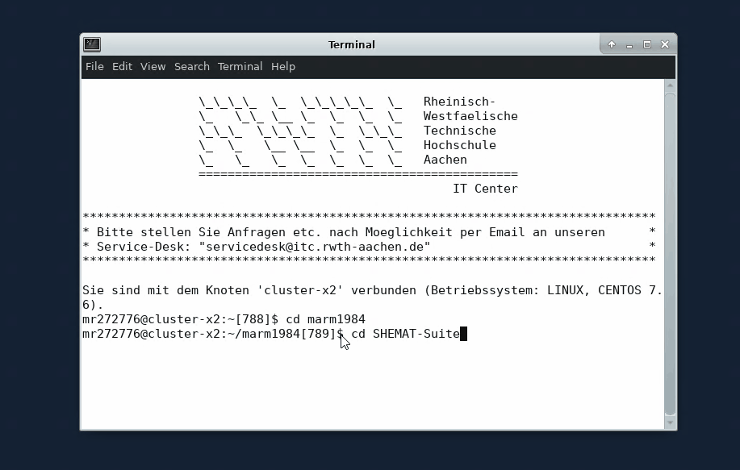

[](http://www.rwth-aachen.de/cms/~a/root/?lidx=1)
# Single Ground source Heat Exchanger model for SHEMAT-Suite

Description for a basic numerical simulation for a groundsource heat exchanger (GHE) in SHEMAT-Suite. File requirements, data requirements and general procedure.

[](https://www.springer.com/de/book/9783540438687)

## Implementation

As any other SHEMAT Suite model, in order to simulate GHEs there are some input files as requirement. All these files have to be at the same directory for future SHEMAT execution:

- [ ] Compile Source                       ---> [Compilation][c74de83a]
- [ ] GHE parameter file                   ---> [GHE-Module][324b04e0]
- [ ] GHE initial conditions file          ---> [GHE-Module][324b04e0]
- [ ] Classic SHEMAT input file            ---> [SHEMAT-SUITE Input File][63a42ee8]

  [63a42ee8]: https://ggewiki.eonerc.rwth-aachen.de/index.php/Input_File "INPUT FILE"
  [324b04e0]: https://ggewiki.eonerc.rwth-aachen.de/index.php?title=GHE-Module_for_heat_exchanger_simulations&action=edit&redlink=1 "GHE-Module-SHEMAT-Suite"
  [c74de83a]: https://ggewiki.eonerc.rwth-aachen.de/index.php/Compilation "Compilation GHE"

## Brief explanation and example
### 1. Compile the source code
To simulate specifically GHE within SHEMAT, it has to be set within the command line the specific PROPS and USER in order to get the executable already compiled and ready for simulate.

```linux
PROPS=gheexpl USER =gheexpl
```

Other parameters are already explained in the wiki page from the SHEMAT-SUITE within the section "compilation" (Check the list). For instance:

```linux
gmake fw COMPTYPE=ling64 PROPS=gheexpl USER=gheexpl hdf HDF5_LIB=$HDF5_ROOT/lib HDF5_MOD=$HDF5_ROOT/include -j 12
```
##Modules load


## Compilation

You can find the executable within the main folder.

### 2. GHE parameter file (ghe_new.par)

There is a file in this folder as well with the parameters for the parameters of the BHE at EON building.

### 3.GHE initial conditions (ghe_ini_new.ini)
The file in this folder called ghe_ini_new.ini, contains the desired output parameters for our model.
This file is extensible described in the wiki [WIKI GGE](https://ggewiki.eonerc.rwth-aachen.de/index.php/GHE-Module_for_heat_exchanger_simulations#HAPPY_SIMULATION), in which you can understad what is the meaning of each flag. As the previous file, this example is set with the GHE from EON building.

## 4.Classic SHEMAT input file

As was mentioned before, this model is based on EONERC single BHE. The parameters set for this model are exactly for one of the 41 GHE of the area. The file called "Sondenfeld_ERC_suite_einzelsonde"


## Usage

Having all the requiered files in the same folder, you just have to proceed to simulate within SHEMAT. It is important to mention, the need for additional files described in the wiki that you can find also here. The description is as well possible to find it within the wiki [WIKI GGE](https://ggewiki.eonerc.rwth-aachen.de/index.php/GHE-Module_for_heat_exchanger_simulations#HAPPY_SIMULATION).

## Running in SHEMAT

## License
[MIT](https://opensource.org/licenses/MIT)
### Happy simulating!
